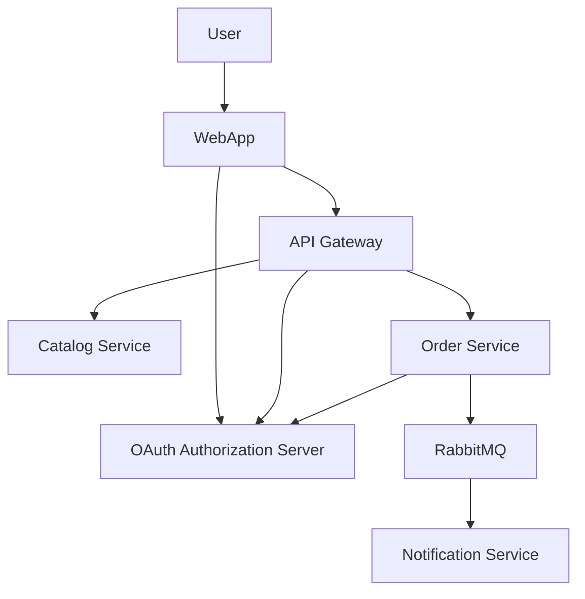

# Microservices Architecture

This diagram represents the architecture of a microservices-based application.

### Local Development Setup
- Java 21
- [SDKMAN](https://sdkman.io) for managing Java & maven version
- Github & Git actions
- Docker & docker-compose
- Postgresql
- [taskfile](https://taskfile.dev) for task running
- [testcontainers](https://testcontainers.com)

### Testing
- [JUnit 5](https://junit.org/junit5/) -- testing framework
- [RestAssured](https://rest-assured.io) -- integration test
- [Testcontainers](https://testcontainers.com) -- for database instance in unit testing
- [awaitility](https://github.com/awaitility/awaitility/wiki/Getting_Started)
- [WireMock](https://wiremock.org) -- mock api
